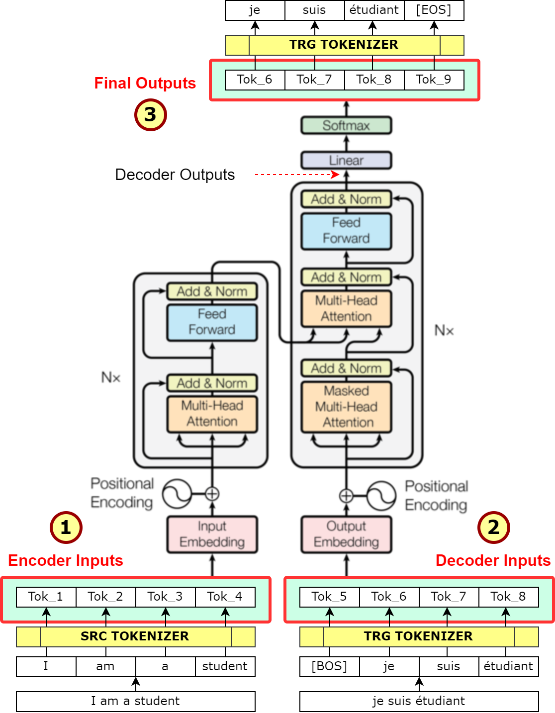

## Transformer

### concept

当下如果要聊大模型，无法避开的即是Transformer的介绍。因此本节尽可能简单的介绍你需要知道的一切概念,
先看这张避不开的Transformer架构图，以下是一个翻译任务中的常见版本：

1. token：简单理解成大模型输入/输出的最小单位
2. embedding： 可以理解成1中token的数学表达，可以理解成一个高维向量
3. encoder/decoder： 编解码通常意味着转换，如文字到ASCII码的过程称为编码。大模型中这个转换的过程通常表示token到embedding的转换
4. self-attention： 可以理解为n^2次计算输入文本之间的关系，如"I am a student"第一次遍历I与am、a、student的关系... 
   1. attention: 即4中关系的数学表达，可以理解成一个加权平均
   2. 这个加权平均的权重是如何得到的呢？
      1. 先对每个token的embedding随机做几次向量乘法可以得到初始的QKV（3个向量）
      2. 在计算I与am的关系时把I的Q和am的k做点积，依次类推
      3. 点积的结果我们称为兼容性分数(compatibility score)
      4. 可是这样带来一个问题，即分数总是在一个较大的区间、有可能为负（即这个词与查询词无正向关系）等等
      5. 因此我们需要经过一个数学计算把兼容性分数映射到[0,1]区间，即softmax函数。
      6. 其中：softmax(xi) = e^xi / Σj e^xj
   3. 这样之后我们得到了I由0.05*am+0.8*a+0.15*student
5. completion: 

[//]: # (todo p33)

| Q               | K                     | 兼容性分数 | softmax后 |
|-----------------|-----------------------|-------|----------|
| I[-0.2,1.4,0.4] | am[0.6,-0.1,1.7]      | 0.42  | 0.05     |
| I[-0.2,1.4,0.4] | a[0.9,1.3,1.7]        | 2.32  | 0.8      |
| I[-0.2,1.4,0.4] | Student[-0.9,0.1,1.6] | 0.96  | 0.15     |

### 类型

transformer包括3种变体

#### encoder-only（自编码模型）

今天我们在讨论encoder-only时基本就是在讨论BERT，它的一个常见训练方式称为Masked LM，即随机mask掉一些token，让模型预测这些被mask的token。因此它在生成更多上下文的任务中效果通常一般，常被用来解决文本分类问题。

#### decoder-only（自回归模型）

即GPT，它使用因果语言建模（causal language modeling）的方式训练，除了被预测的token，其他token都被mask掉。

#### encoder-decoder

如T5模型，使用连续多个token的掩码进行预训练。常用于翻译、文本概括。

## 显存

### 模型大小
什么是模型参数，还记得上文中提到的Transformer需要初始化QKV吗？其中这个初始的矩阵乘法可以表达为：Wx+b（x=Embedding(token)）。
- W： 权重矩阵,表示从一层神经元到另一层神经元的连接强度
- b： 偏置项，表示神经元激活前的偏移量
- 模型的预训练通常就是在确定W和b。

在32位全精度下，单个参数用4字节表示，因此一个1B的模型需要4GB显存，但是通常一个训练任务需要额外的开销，因此训练时的显存需要通常大于推理：

| 状态               | 每个参数所占字符 |
|------------------|----------|
| 模型参数（权重）         | 4        |
| Adam优化器（2个状态）    | 8        |
| 梯度               | 4        |
| 激活值和临时函数变量（可变大小） | 8（预估）    |
| 总计               | 4+20     |

### 量化
量化时一种流行的降模型参数从32位转换为更小的方法（通常时16、8、4），如16位半精度时对于显存的需求减少50%，书上关于量化的介绍“量化是一个将一组高精度浮点数映射到一组低精度目标数的过程。使用源范围和目标范围，量化机制首先计算一个缩放因子，然后进行映射”：

- 1B全精度：load 4GB｜train 24GB
- 1B 16位半精度：load 2GB｜train 12GB
- 1B 8位量化：load 1GB｜train 6GB

上面介绍的32、16、8、4就是我们在PyTorch、TensorFlow中常说的fp32、fp16、int8、int4。除了以上这些标准的量化，还有一些更加现代的量化方法如bfloat16。

我们先看浮点数如何表示pi：pi = 3.14159265358979323846...
1. fp32：把实数映射到-3e38～3e38的范围：pi=(−1)^0 x 2 x (1.10010010000111111011011)=3.14159274101257324219
   1. 实际上这个32位4字节的浮点数表示由3个部分组成：
   2. 符号位：0表示正数，1表示负数，即上式中-1的指数
   3. 指数：8位动态范围，真实指数=存储指数−（2^指数位数-1）=128−127=1
   4. 尾数：顾名思义，表示小数部分
2. fp16: 把实数从fp32映射到-65504～65504: pi=(−1)^0 x 2 x (1.1001001000)=3.140625
   1. 符号位：同样是1位
   2. 指数：5位
   3. 尾数：10位
3. bfloat16: 实际上时把更多的位数让给指数位获取更大的动态范围
   1. 符号位：同样是1位
   2. 指数：8位
   3. 尾数：7位
4. fp8: 从fp16和bfloat16演进而来 fp8允许用户根据任务分配剩余的7位给指数或尾数
5. int8: int8类型的量化可以理解为没有指数位，7位全部给到尾数因此范围是-128～127. pi = 3

### 优化自注意力层

#### FlashAttention
前面我们介绍了Transformer的自注意力层，它需要计算和显存的数量都呈现n^2的关系。FlashAttention最初在一个研究论文中提出（“FlashAttention: Fast and Memory-Efficient Exact Attention with IO-Awareness”,Arxiv,2022）. 
它可以将自注意力性能提高2～4倍，并将显存需求降低80%～90%。

#### 分组查询注意力
对自注意力层的优化的另一种方式是分组查询注意力（GQA）。GQA为每组Q共享单一K和V。

### 分布式
顾名思义，用更多的卡。常见的分片方式是DDP（Distributed Data Parallel）和FSDP（Fully Sharded Data Parallel），不过代价是产生通信开销，通常是工程中需要集中解决的问题。FSDP是在DDP的基础上进一步优化，它可以更进一步减少内存占用。

## 微调和评估

1. instruct fine-tuning
2. PEFT：PEFT因为会冻结原始模型参数并只微调少量新的模型参数，因此计算和显存需求较低、不容易出现灾难性遗忘、适合基础模型的多租户场景。
   1. LORA： 
      1. 在原始权重边插入一对低秩的分解矩阵，例如一个512*64维度的参数如果全量微调需要训练64*512=32768个参数，假设秩为4，则需要训练4*（512+64）=2304个参数
      2. 用的最多的或许是Stable Diffusion用于固定某些IP形象或风格
   2. QLORA：将量化与LORA结合进一步降低显存需求
   3. Prompt Tuning：向输入提示中添加额外可训练的token。
3. RLHF：使用人类注释帮助模型对齐

## 推理优化

### 剪枝
去掉模型中冗余或不重要的参数，减小模型体积和计算次数：
1. 实操中通常是消除哪些值为0或接近0的权重
2. 实际上有的模型只有很少一部分权重为0
3. sparseGPT是一种针对语言的生成式基础模型的训练后剪枝方法

### 量化
PTQ：训练后量化与之前介绍的量化类似，旨在将模型的权重转换为低精度表示
1. GPTQ最早在论文（GPTQ: Accurate Post-Training Quantization for Generative Pre-Trained Transformers, arXiv, 2023）中提出，分析模型的每一层并以有助于减少量化中会出现的精度损失的方式来近似权重。
2. Optimum中的GPTQ是常见的PTQ库

### 蒸馏
缩小模型体积的技术，基于较大的Teacher模型训练一个较小的Student模型，模型参数大为减少并保留大模型的准确率。

## AI Native Application

### RAG
RAG的概念就不阐述了，网上很多。通常用于访问训练以外的数据：如私有数据、训练完成后的数据等

#### chunk

#### recall

#### rerank

### Agent
