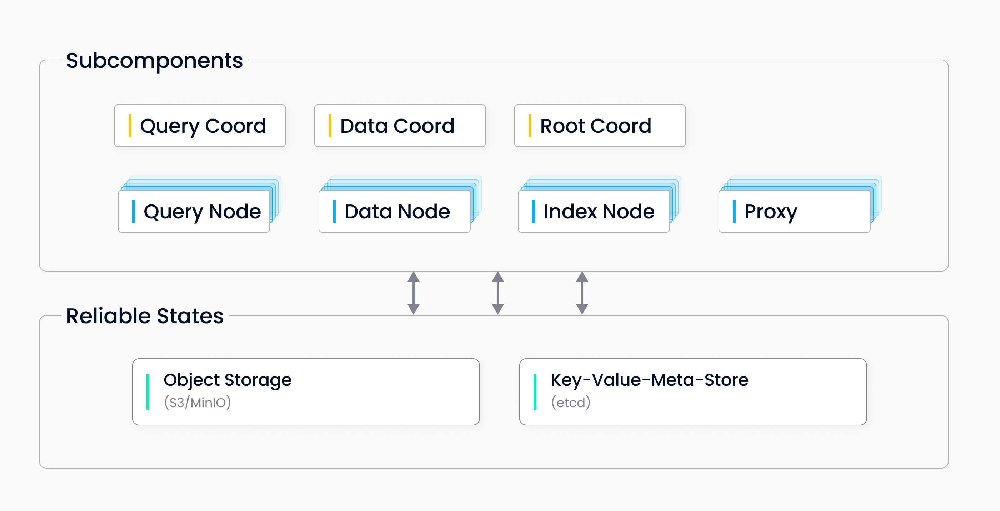

# Milvus

向量数据库由来已久，llm的来临再次带火了这个概念，本文是学习milvus的笔记，尽可能从工程开发者的角度说清楚milvus

## 架构
官网介绍了milvus建立在Faiss、HNSW、DiskANN、SCANN等向量搜索库之上，我们先弄清楚这些都是啥：
1. Faiss： facebook(meta)开源的一个高效相似度搜索和稠密向量聚类的库，主要用于处理和搜索高维稠密向量。最早用来用在推荐系统、NLP、CV方向。我们可以从API和quickstart大概感受一下Faiss的画风：
   1. index = faiss.IndexFlatL2(d) # create a flat (not clustered) index
   2. index.add(xb) # add vectors to the index
   3. D, I = index.search(xb[:5], k) # sanity check
   4. D, I = index.search(xq, k)     # actual search
   5. 基本上你可以把Faiss看作第一代的向量数据库
2. HNSW、DiskANN 和 ScaNN准确的说都是一些近似最近邻搜索算法, 我们都知道向量检索的本质是高维空间中2个点的距离，但是在工程中该搜索“哪些点”获得最好的工程效果和响应时间要优于暴力穷举呢？这类算法统一称为ANN算法。
   1. HNSW（**分层查询**）：Hierarchical Navigable Small Worlds，你可以粗略的理解为向量存储中的“跳表”，借助分层的思想来缩小精确检索的范围
   2. DiskANN（**IO优化**）：DiskANN虽然叫Disk，但是实际上它做了两类优化：1是把最频繁访问的图节点（通常是高层的中心点）存储在内存中， 2是利用预取和顺序读的技术优化了磁盘I/O
   3. ScaNN（**精度换速度**）：Scalable Nearest Neighbor Algorithms，本质上是一种量化或者叫压缩，通过降低维度或者分段量化的手段用精度换速度

### 云原生架构

以下是Milvus的架构图：

milvus参考了现代化的云原生数据库的存算分离架构，做到了大部分节点的无状态，唯一有状态的是etcd，架构总的分为以下几个部分：
1. 控制层：右上方可以看到三类称为“协调员”的节点：
   1. root coord： Root coord 处理数据定义语言 (DDL) 和数据控制语言 (DCL) 请求，例如创建或删除集合、分区或索引，以及管理 TSO (时间戳 Oracle) 和时间行情发布。
   2. query coord： 查询协调器管理查询节点的拓扑和负载平衡，以及从增长段到密封段的切换。
   3. data coord： 数据协调器负责管理数据节点和索引节点的拓扑结构、维护元数据，以及触发flush、 compact、索引构建等后台数据操作。
2. 流量层：由sdk、lb、proxy、message组成
3. 工作节点：
   1. Query Node: 执行查询任务，负责向量检索、相似度计算等操作。
   2. Data Node：处理数据写入任务，将用户数据写入到持久化存储（Binlog）。
   3. Index Node：构建向量索引（如 HNSW、IVF），优化检索性能。
4. 存储：高性能OSS 

### standalone
以上是云原生版、集群版的架构，我们在POC中更常见到的是下面这种架构：

## 向量执行引擎
Milvus的向量执行引擎称为Knowhere，类似Faiss。以下是Knowhere的优势：
1. Knowhere支持异构计算，为未来的GPU、TPU加速预留了可能
2. 支持软删除，官方称为BitsetView
3. 支持不同近似度指标
4. 支持相比Faiss更多的SIMD 指令， 如AVX512指令集（用于更高效的索引构建和查询的性能提升）

## 一致性：
### 等级
由于向量存储一般不会需要强的一致性，本章节只做简单介绍，milvus支持4个等级：
1. Strong：强一致性，全局一致
2. Bounded staleness： 有界一致性
3. Session: 会话内一致性
4. Eventually： 最终一致性

### TSO
Milvus一致性的方案与google的Spanner很像，核心思想是全局采信一个timeline，milvus官网专门介绍了他们如何去做这个时钟同步。因此冲突总是能够基于时间去解决。
> 《Spanner: Google's Globally Distributed Database》
> https://dl.acm.org/doi/abs/10.1145/2491245

## 近似度算法：
各种数学公式参考官网：https://milvus.io/docs/metric.md?tab=floating
1. 浮点嵌入：
   1. L2欧几里得距离
   2. IP内积
   3. COSINE：余弦相似度，余弦的好处是结果表示2个向量的夹角，在-1～1之间
2. 二进制&稀疏。因为大部分讨论的背景是大模型与RAG，因此这里的embedding我们不讨论，需要知道milvus也支持bin和sparse即可

## 索引类型
索引类型与近似度算法类似，我们仅介绍浮点类型的：
1. FLAT： 暴力检索
2. IVF_FLAT： IVF即倒排，倒排到一个数据簇之后继续暴力查找
3. IVF_SQ8： IVF + Quantization 倒排+8-bit量化
4. IVF_PQ： IVF + Product Quantization 倒排+PQ量化
5. HNSW：前文介绍过了
6. SCANN：前文介绍过了

以上6种都是内存索引，此外还包括之前介绍过的DiskANN和GPU Index

## ranker

1. WeightedRanker：权重rank，可以利用多种向量维度加权计算近似度
2. RRFRanker: 即不知道权重情况下的混合检索
