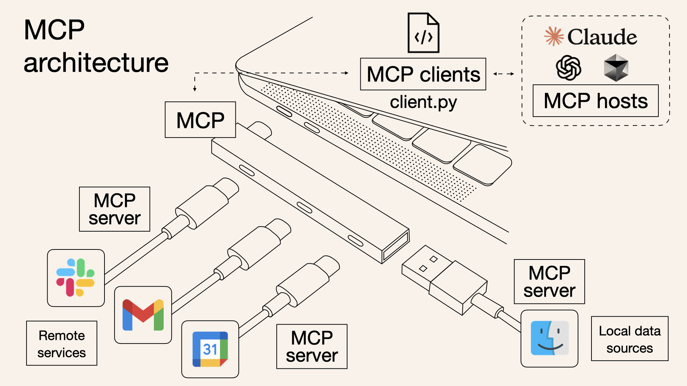

# 介绍

## 官方文档
[官方开发者首页](https://modelcontextprotocol.io/introduction)  
[中文版](https://docs.modelcontextprotocol.vip/introduction)  
模型上下文协议（MCP） 就像是为AI模型量身定制的“USB-C接口”，可以标准化地连接AI系统与各类外部工具和数据源。

## 架构图


## MCP 核心概念

## 市面上的client产品
在介绍核心概念之前，可以看一下截止25年3月的各大Client对于MCP功能不同维度的支持情况，如果你用过其中的一些会有一个更清晰的认知:  

| Client | Resources | Prompts | Tools | Sampling | Roots | Notes                                                              |
|--------|-----------|---------|-------|----------|-------|--------------------------------------------------------------------|
| Claude Desktop App | ✅ | ✅ | ✅ | ❌ | ❌ | Full support for all MCP features                                  |
| 5ire | ❌ | ❌ | ✅ | ❌ | ❌ | Supports tools.                                                    |
| BeeAI Framework | ❌ | ❌ | ✅ | ❌ | ❌ | Supports tools in agentic workflows.                               |
| Cline | ✅ | ❌ | ✅ | ❌ | ❌ | Supports tools and resources.                                      |
| Continue | ✅ | ✅ | ✅ | ❌ | ❌ | Full support for all MCP features                                  |
| Cursor | ❌ | ❌ | ✅ | ❌ | ❌ | Supports tools.                                                    |
| Emacs Mcp | ❌ | ❌ | ✅ | ❌ | ❌ | Supports tools in Emacs.                                           |
| Firebase Genkit | ⚠️ | ✅ | ✅ | ❌ | ❌ | Supports resource list and lookup through tools.                   |
| GenAIScript | ❌ | ❌ | ✅ | ❌ | ❌ | Supports tools.                                                    |
| Goose | ❌ | ❌ | ✅ | ❌ | ❌ | Supports tools.                                                    |
| LibreChat | ❌ | ❌ | ✅ | ❌ | ❌ | Supports tools for Agents                                          |
| mcp-agent | ❌ | ❌ | ✅ | ⚠️ | ❌ | Supports tools, server connection management, and agent workflows. |
| oterm | ❌ | ❌ | ✅ | ❌ | ❌ | Supports tools.                                                    |
| Roo Code | ✅ | ❌ | ✅ | ❌ | ❌ | Supports tools and resources.                                      |
| Sourcegraph Cody | ✅ | ❌ | ❌ | ❌ | ❌ | Supports resources through OpenCTX                                 |
| Superinterface | ❌ | ❌ | ✅ | ❌ | ❌ | Supports tools                                                     |
| TheiaAI/TheiaIDE | ❌ | ❌ | ✅ | ❌ | ❌ | Supports tools for Agents in Theia AI and the AI-powered Theia IDE |
| Windsurf Editor | ❌ | ❌ | ✅ | ❌ | ❌ | Supports tools with AI Flow for collaborative development.         |
| Zed | ❌ | ✅ | ❌ | ❌ | ❌ | Prompts appear as slash commands                                   |
| SpinAI | ❌ | ❌ | ✅ | ❌ | ❌ | Supports tools for Typescript AI Agents                            |
| OpenSumi | ❌ | ❌ | ✅ | ❌ | ❌ | Supports tools in OpenSumi                                         |
| Daydreams Agents | ✅ | ✅ | ✅ | ❌ | ❌ | Support for drop in Servers to Daydreams agents                    |

## 核心概念

MCP官方文档设计了6大核心概念：
1. 资源Resources
2. 提示词Prompts
3. 工具Tools
4. 采样Sampling
5. 根节点Roots
6. 传输Transports

从这几个核心概念可以看出Anthropic的设计哲学是希望把大模型推理过程中涉及到的所有可能的元素都解藕到mcp-server中, 包括提示词和沙箱。这样客户端只要关注高效“链接”，对Host搞定inference，对server搞定Agent。  


但从上面的“开服玩家”来看，cursor、windsurf 2大巨头还是选择只支持Tools，这一方面体现了MCP本质还是FunctionCall再更底层layer的延伸，另一方面也说明了出于商业角度的考虑各个玩家还是希望集中式管理自己的提示词和逻辑，能不能被hack出提示词是一回事，提示词和逻辑是他们的核心资产是另一回事。  


加上Resources本质上也是透过Tools去获取的，因此本文不去细究每一种概念的使用，感兴趣的可以自行阅读原文档，本文聚焦解释**MCP的Tools**具体技术实现原理，帮助读者理解MCP如何能够work

# Tools how to work


## 全双工通信

对MCP感兴趣的人大多数看过下面这张图，可以看到每个MCP Server对Client之间都是一个双向箭头，它意味着什么?


## endpoint list
弄清楚这个双向箭头就基本上能理解MCP的架构设计哲学了，我们先来看官方Java-SDK的endpoint定义:（另，官方的Java SDK看文档提到貌似是SpringAI的那帮人贡献的，SpringAI本身有点一言难尽，但MCP SDK写的真的非常优雅感兴趣的可以去看一下[Java-SDK](https://github.com/modelcontextprotocol/java-sdk)）

```java
	// Lifecycle Methods
	public static final String METHOD_INITIALIZE = "initialize";
	public static final String METHOD_NOTIFICATION_INITIALIZED = "notifications/initialized";
	public static final String METHOD_PING = "ping";

	// Tool Methods
	public static final String METHOD_TOOLS_LIST = "tools/list";
	public static final String METHOD_TOOLS_CALL = "tools/call";
	public static final String METHOD_NOTIFICATION_TOOLS_LIST_CHANGED = "notifications/tools/list_changed";

	// Resources Methods
	public static final String METHOD_RESOURCES_LIST = "resources/list";
	public static final String METHOD_RESOURCES_READ = "resources/read";
	public static final String METHOD_NOTIFICATION_RESOURCES_LIST_CHANGED = "notifications/resources/list_changed";
	public static final String METHOD_RESOURCES_TEMPLATES_LIST = "resources/templates/list";
	public static final String METHOD_RESOURCES_SUBSCRIBE = "resources/subscribe";
	public static final String METHOD_RESOURCES_UNSUBSCRIBE = "resources/unsubscribe";

	// Prompt Methods
	public static final String METHOD_PROMPT_LIST = "prompts/list";
	public static final String METHOD_PROMPT_GET = "prompts/get";
	public static final String METHOD_NOTIFICATION_PROMPTS_LIST_CHANGED = "notifications/prompts/list_changed";

	// Logging Methods
	public static final String METHOD_LOGGING_SET_LEVEL = "logging/setLevel";
	public static final String METHOD_NOTIFICATION_MESSAGE = "notifications/message";

	// Roots Methods
	public static final String METHOD_ROOTS_LIST = "roots/list";
	public static final String METHOD_NOTIFICATION_ROOTS_LIST_CHANGED = "notifications/roots/list_changed";

	// Sampling Methods
	public static final String METHOD_SAMPLING_CREATE_MESSAGE = "sampling/createMessage"; 
```

## 消息结构
MCP在API层选择了[json-rpc 2.0协议](https://www.jsonrpc.org/specification), 以tool_list功能举例数据结构类似这样:
```json
{
  "jsonrpc": "2.0",
  "method": "tools/list",
  "id": "1",
  "params": null
}
```

## 参考官方SDK实现双向通信

mcp是如何实现双向通信的？mcp实际上有stdio和sse2种实现模式，考虑到remote server是事实上的绝大多数场景，本章节着重讲sse版本， mcp通过维护1个sse接口和1个restful接口来实现C/S架构的双向通信(吐槽一下这样都不用websocket,sse真是大模型的亲儿子)
1. 服务端需要实现2个接口，以默认的/sse和/mcp/message为例，/sse的接口是为了服务端给客户端去推消息，/mcp/message接口是用来客户端去调服务端发送命令的
2. 这套设计很反直觉，当你开发server端的时候，当你收到/mcp/message的请求的时候你实际上只要保证“处理逻辑能正确分发”就可以返回200，不需要返回任何处理结果。同时你要把处理的结果通过/sse接口异步的通知给客户端，因此这里的session保持客观上增加了系统的复杂度。
3. 流程如下：
   1. 客户端调用/sse接口拿到endpoint（即前文提到的/mcp/message，实际上由server端自己定），/sse接口理论上只要client端不主动发close server端就应当永久保持
   2. 拿到endpoint接口之后客户端就可以通过这个接口去请求初始化、serverInfo和toolList等接口获取server端能提供哪些能力
   3. 服务端正确分发异步的处理逻辑之后返回空body的200
   4. 服务端处理完成之后通过/sse接口异步推送JsonRpcResponse
4. 官方的python demo很好的说明了这个过程可以看以下代码：
```python
# 步骤1～4的python实现
async def connect_to_server(self, server_script_path: str):
    """Connect to an MCP server

    Args:
        server_script_path: Path to the server script (.py or .js)
    """
    is_python = server_script_path.endswith('.py')
    is_js = server_script_path.endswith('.js')
    if not (is_python or is_js):
        raise ValueError("Server script must be a .py or .js file")

    command = "python" if is_python else "node"
    server_params = StdioServerParameters(
        command=command,
        args=[server_script_path],
        env=None
    )

    stdio_transport = await self.exit_stack.enter_async_context(stdio_client(server_params))
    self.stdio, self.write = stdio_transport
    self.session = await self.exit_stack.enter_async_context(ClientSession(self.stdio, self.write))

    await self.session.initialize()

    # List available tools
    response = await self.session.list_tools()
    tools = response.tools
    print("\nConnected to server with tools:", [tool.name for tool in tools])
```
5. 拿到server端能干什么之后客户端就可以根据大模型的决策去动态的使用这些工具了，官方的python demo如下：
```python
async def process_query(self, query: str) -> str:
    """Process a query using Claude and available tools"""
    messages = [
        {
            "role": "user",
            "content": query
        }
    ]

    response = await self.session.list_tools()
    available_tools = [{
        "name": tool.name,
        "description": tool.description,
        "input_schema": tool.inputSchema
    } for tool in response.tools]

    # Initial Claude API call
    response = self.anthropic.messages.create(
        model="claude-3-5-sonnet-20241022",
        max_tokens=1000,
        messages=messages,
        tools=available_tools
    )

    # Process response and handle tool calls
    final_text = []

    assistant_message_content = []
    for content in response.content:
        if content.type == 'text':
            final_text.append(content.text)
            assistant_message_content.append(content)
        elif content.type == 'tool_use':
            tool_name = content.name
            tool_args = content.input

            # Execute tool call
            result = await self.session.call_tool(tool_name, tool_args)
            final_text.append(f"[Calling tool {tool_name} with args {tool_args}]")

            assistant_message_content.append(content)
            messages.append({
                "role": "assistant",
                "content": assistant_message_content
            })
            messages.append({
                "role": "user",
                "content": [
                    {
                        "type": "tool_result",
                        "tool_use_id": content.id,
                        "content": result.content
                    }
                ]
            })

            # Get next response from Claude
            response = self.anthropic.messages.create(
                model="claude-3-5-sonnet-20241022",
                max_tokens=1000,
                messages=messages,
                tools=available_tools
            )

            final_text.append(response.content[0].text)

    return "\n".join(final_text)
```

## lab
我们以cursor为例看一下如果我们开发一个FileTools的MCP绑定到cursor上实际上发生了哪些交互： 
- 在cursor上配置sse的端口:  

- 服务端收到的请求如下：
  - 初始化时依次收到initialize请求, tool/resource/template的list请求
  - 当用户问本地文件相关的问题时再调tool/call
  

### server demo
```java
//server
package io.modelcontextprotocol.configs;

import com.fasterxml.jackson.databind.ObjectMapper;
import io.modelcontextprotocol.server.McpServer;
import io.modelcontextprotocol.server.McpSyncServer;
import io.modelcontextprotocol.server.transport.WebFluxSseServerTransport;
import io.modelcontextprotocol.spec.McpSchema.LoggingLevel;
import io.modelcontextprotocol.spec.McpSchema.LoggingMessageNotification;
import io.modelcontextprotocol.spec.McpSchema.ServerCapabilities;
import io.modelcontextprotocol.tools.FileTools;
import org.springframework.context.annotation.Bean;
import org.springframework.context.annotation.Configuration;
import org.springframework.web.reactive.function.server.RouterFunction;

@Configuration
class McpConfig {

  @Bean
  WebFluxSseServerTransport webFluxSseServerTransport(ObjectMapper mapper) {
    return new WebFluxSseServerTransport(mapper, "/mcp/message");
  }

  @Bean
  RouterFunction<?> mcpRouterFunction(WebFluxSseServerTransport transport) {
    return transport.getRouterFunction();
  }

  @Bean
  McpSyncServer mcpSyncServer(WebFluxSseServerTransport transport) {
    // Create a server with custom configuration
    McpSyncServer syncServer = McpServer.sync(transport)
      .serverInfo("my-server", "1.0.0")
      .capabilities(ServerCapabilities.builder()
        .resources(true, true)     // Enable resource support
        .tools(true)         // Enable tool support
        .prompts(true)       // Enable prompt support
        .logging()           // Enable logging support
        .build())
      .build();

    // Register tools, resources, and prompts
    syncServer.addTool(FileTools.getReadFileToolRegistration());
    syncServer.addTool(FileTools.getListDirectoryToolRegistration());

    // Send logging notifications
    syncServer.loggingNotification(LoggingMessageNotification.builder()
      .level(LoggingLevel.DEBUG)
      .logger("custom-logger")
      .data("Server initialized")
      .build());
    return syncServer;
  }
}
```

### client demo 
```java
//client
package io.modelcontextprotocol.clients;

import static io.modelcontextprotocol.spec.McpSchema.METHOD_TOOLS_LIST;

import io.modelcontextprotocol.client.transport.WebFluxSseClientTransport;
import io.modelcontextprotocol.spec.McpSchema;
import io.modelcontextprotocol.spec.McpSchema.JSONRPCNotification;
import io.modelcontextprotocol.spec.McpSchema.JSONRPCRequest;
import io.modelcontextprotocol.spec.McpSchema.JSONRPCResponse;
import java.util.UUID;
import org.springframework.web.reactive.function.client.WebClient;

public class MyClient {

  static String host = "http://localhost:8080";


  public static void main(String[] args) throws InterruptedException {
    WebFluxSseClientTransport transport = new WebFluxSseClientTransport(
      WebClient.builder().baseUrl(host));

    transport.connect(message -> {
      // 处理消息
      return message.doOnNext(msg -> {
        System.out.println("接收到消息: " + msg);

        // 根据消息类型进行不同处理
        if (msg instanceof JSONRPCResponse response) {
          System.out.println("响应 ID: " + response.id());
          System.out.println("结果: " + response.result());
          if (response.error() != null) {
            System.out.println("错误: " + response.error());
          }
        } else if (msg instanceof JSONRPCRequest request) {
          System.out.println("请求 ID: " + request.id());
          System.out.println("方法: " + request.method());
        } else if (msg instanceof JSONRPCNotification notification) {
          System.out.println("通知方法: " + notification.method());
        }
      }).doOnError(error -> {
        System.err.println("处理消息时出错: " + error.getMessage());
      });
    }).block(); // 阻塞等待连接建立

    String requestId = UUID.randomUUID().toString();

    var request = new McpSchema.JSONRPCRequest(McpSchema.JSONRPC_VERSION,
      METHOD_TOOLS_LIST, requestId,
      null);
    transport.sendMessage(request).block(); // 阻塞等待消息发送完成

    // 等待足够长的时间以接收响应
    Thread.sleep(5000);

    // 关闭连接
    transport.close();
  }

}
```

### client收到的推送
```text
接收到消息: JSONRPCResponse[jsonrpc=2.0, id=dace1e50-8f8f-4842-8ffe-0f161370bf90, result={tools=[{name=read_file, description=Read the contents of a file from the local filesystem, inputSchema={type=object, properties={filePath={type=string, description=The absolute path to the file to read}}, required=[filePath]}}, {name=list_directory, description=List the contents of a directory from the local filesystem, inputSchema={type=object, properties={directoryPath={type=string, description=The absolute path to the directory to list}}, required=[directoryPath]}}]}, error=null]
响应 ID: dace1e50-8f8f-4842-8ffe-0f161370bf90
结果: {tools=[{name=read_file, description=Read the contents of a file from the local filesystem, inputSchema={type=object, properties={filePath={type=string, description=The absolute path to the file to read}}, required=[filePath]}}, {name=list_directory, description=List the contents of a directory from the local filesystem, inputSchema={type=object, properties={directoryPath={type=string, description=The absolute path to the directory to list}}, required=[directoryPath]}}]}

```

# 总结
MCP 是一个基于 JSON-RPC 2.0 的协议，用于 AI 模型与外部工具和资源的交互。它采用客户端-服务器架构，通过传输层（如 SSE）进行通信。客户端发送请求，服务器处理请求并提供工具和资源访问。整个协议设计灵活，支持多种传输方式和同步/异步处理模式，适用于各种 AI 应用场景。MCP的server需要实现2个接口，1个sse的接口负责向客户端推送各种response，1个restful的POST接口用于接受客户端的各种命令

完整demo代码：  
https://github.com/aconeshana/java-sdk/tree/main/mcp-spring-example
