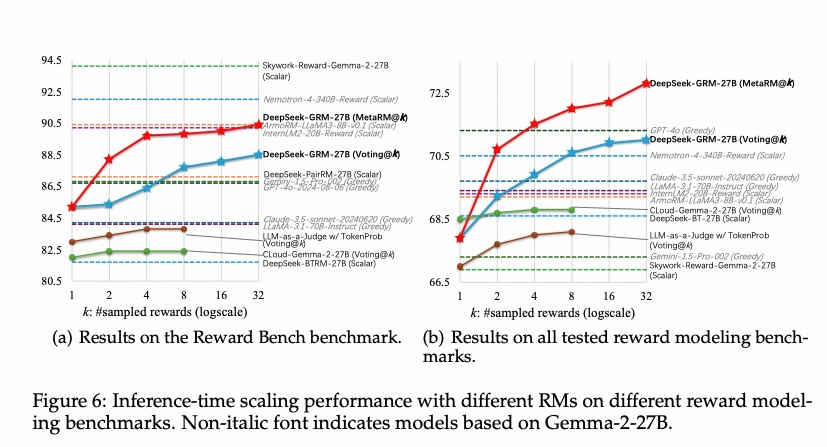
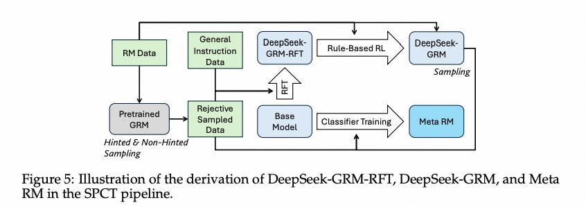

## 引言

近期，国内人工智能公司DeepSeek在大型语言模型（LLM）领域再掀波澜，发布了一项名为SPCT（Sparse Pre-training and Context Tuning）的新技术，旨在提升通用奖励模型（General Reward Model, GRM）的性能和AI对齐效率。这项技术不仅展示了DeepSeek在模型优化方面的深厚实力，也可能预示着其下一代模型（如传闻中的R2）的技术方向。

## 什么是奖励模型（Reward Model）？

在深入SPCT之前，我们先简单了解一下奖励模型。在LLM的训练过程中，特别是通过人类反馈进行强化学习（RLHF）时，奖励模型扮演着至关重要的角色。它负责评估LLM生成的不同响应的好坏，并给出一个分数（奖励信号），指导LLM朝着更符合人类偏好、更安全、更有用的方向优化。

然而，传统的奖励模型往往直接对输出进行打分，难以捕捉复杂的、依赖上下文的判断标准，尤其是在面对通用任务和多样化指令时。

## Reward Generation Paradigms 和 Scoring Patterns

### concept

**奖励生成范式 (Reward Generation Paradigms)** 主要有以下三种：

| 范式 (Paradigm)        | 描述 (Description) |
|:---------------------| :----------------- |
| (a)标量 (Scalar)       | 这种方法直接为给定的查询和回复分配一个标量值作为奖励。这个标量值代表了模型对回复质量的评估。 |
| (b)半标量 (Semi-Scalar) | 这种方法不仅生成一个标量奖励值，还会生成一段文本形式的判断或评论 (Critique)。评论可以解释模型给出该标量奖励的原因。 |
| (c)生成式 (Generative)  | 这种方法只生成文本形式的评论 (Critique) 作为奖励。奖励值可以从生成的文本中提取出来（例如，评论中直接包含分数，或者通过分析评论内容来判断偏好）。 |

**评分模式 (Scoring Patterns)** 主要有两种：  

点式直接评价response，对式评价2个response之间的正负关系（哪个更好）  

| 模式 (Pattern)      | 描述 (Description) |
|:------------------| :----------------- |
| (i)点式 (Pointwise) | 这种方法独立地为每一个给定的回复分配一个分数。它可以接受单个或多个回复作为输入，并为每个回复都给出一个评估。 |
| (ii)成对 (Pairwise) | 这种方法主要考虑两个回复之间的相对偏好。模型通常会判断在给定的两个回复中，哪一个更好。虽然这种方法可以扩展到处理多个回复，但通常需要额外的技术。 |

### 组合

1. (a) + (i) = Bradley-Terry: 生成标量评分并对每个回复打分，即图中的0.251和-0.707
2. (a) + (ii) = PairRM: 生成标量评分并对两个回复进行比较，即图中的>=0和<=0
3. (b) + (i) = CLoud: 生成文本形式的评论和分数, 即图中的critique1/2和0.251，-0.707
4. (b)/(c) + (ii) = LLM-as-a-Judge / TokenProb: 这里生成的critique即包含了哪个更好，即方法2中的正负号, 用一个特殊的Token表示，即图中的1，再用TokenProb方法提取这个1
5. (c) + (i) = Pointwise GRM: 即直接生成critique和打分

论文用了2个维度来对比5个方法：
1. inference time scalable:   
通过scaling law算力增强模型能力，指的是在不重新训练模型的情况下，通过增加计算资源（例如，进行多次采样）来提升模型在推理阶段的性能。对于那些可以通过多次采样获得不同结果的模型，我们可以通过聚合 (aggregation) 这些不同的结果（例如，通过投票、平均或其他更复杂的策略）来得到一个更稳定和更准确的最终判断。  
对于标量的Reward Model即使我们增加了推理计算次数，但由于标量奖励模型的输出缺乏多样性，我们无法利用这些额外的计算来改进最终的奖励评估。
2. input flexible：输入灵活性  
如果只能针对Pair评价则丧失了input的灵活性

结论：
1. **含有(a)的Scalar Reward Model 必然丧失inference time scalable** 因此1、2是叉
2. **含有(ii)的方法必然丧失input flexible** 因此2、4是叉

### Cloud 与 GRM
通过上一节的结论我们剩下的选择就是3和5了，那么哪个更好呢？或者都和理论一样吗？论文给了结论：

CLoud是绿色那条线，GRM是红色和蓝色的  
CLoud的问题在于半标量虽然生成了评论但分数的方差仍然不大，因此在实验中的scaling law并不明显
因此最终选择是方法5，也就是本文的重点

## SPCT：先定原则，再做判断

DeepSeek提出的SPCT技术，为奖励模型的构建提供了一种新思路。其核心思想是：**让奖励模型首先根据当前上下文生成一套评估原则（Evaluation Principles），然后再基于这些原则对LLM的响应进行判断和打分。**

1. **拒绝式微调(Rejective Fine-Tuning, RFT)**: SPCT的冷启动阶段，让GRM能够生成格式正确的原则和批判，适应各种输入
2. **提示采样(hinted sampling)**: 将真实最佳回复的索引添加到提示中，以期望预测的奖励与真实情况对齐。
3. **基于规则的在线强化学习(Rule-based Online Reinforcement Learning)**: 通过不断优化生成的原则和批判来增强通用奖励生成能力，鼓励GRM区分最佳回复
4. 因此先要训一个meta RM（人工标注）和GRM（生成Principles和critiques并提取标量）,在base model上做RFT时用这2个模型来评价，RFT冷启动后进入GRM在线强化学习

这种“先定原则，再做判断”的方式有几个显著优势：

1.  **更强的泛化能力**：通过动态生成与上下文相关的评估原则，模型能够更好地适应不同的任务和指令，做出更准确的判断。
2.  **更高的透明度和可解释性**：生成的评估原则可以帮助我们理解模型做出判断的依据。
3.  **提升AI对齐效率**：使模型能更有效地学习和遵循人类的偏好及安全准则。

基于SPCT技术，DeepSeek训练了一个名为DeepSeek-GRM的通用奖励模型（论文中使用了DeepSeek-GRM-27B，基于Gemma-2-27B进行后训练）。该模型在训练中学习如何从任何偏好数据集中提取奖励信号。

SPCT的另一个亮点在于其支持有效的**推理时缩放**。在推理（即实际使用）阶段，DeepSeek-GRM可以通过多次并行采样，生成多组不同的评估原则和相应的批判性评估。然后，通过对这些结果进行投票或聚合，可以获得更稳定、更准确的最终奖励判断。

随着采样规模的扩大（即增加推理时的计算量），DeepSeek-GRM能够基于更多样化的原则进行更细粒度的判断，从而在不重新训练模型的情况下提升性能。

---
这篇文章本来2天前发的，太忙了拖到今天已经比较晚了，做个笔记

---

*参考资料：*
*   [精讲（但绝对讲明白）Deepseek的新论文SPCT](https://weibo.com/ttarticle/p/show?id=2309405151808044794138) via[@Transformer-周](https://weibo.com/u/1871474290)
*   [DeepSeek提出通用奖励模型新方法SPCT... (腾讯新闻)](https://news.qq.com/rain/a/20250404A07MR700)
*   [刚刚，DeepSeek公布推理时Scaling新论文... (机器之心)](https://www.jiqizhixin.com/articles/2025-04-04-4)
*   [腾讯元宝+deepseek](https://yuanbao.tencent.com/)
